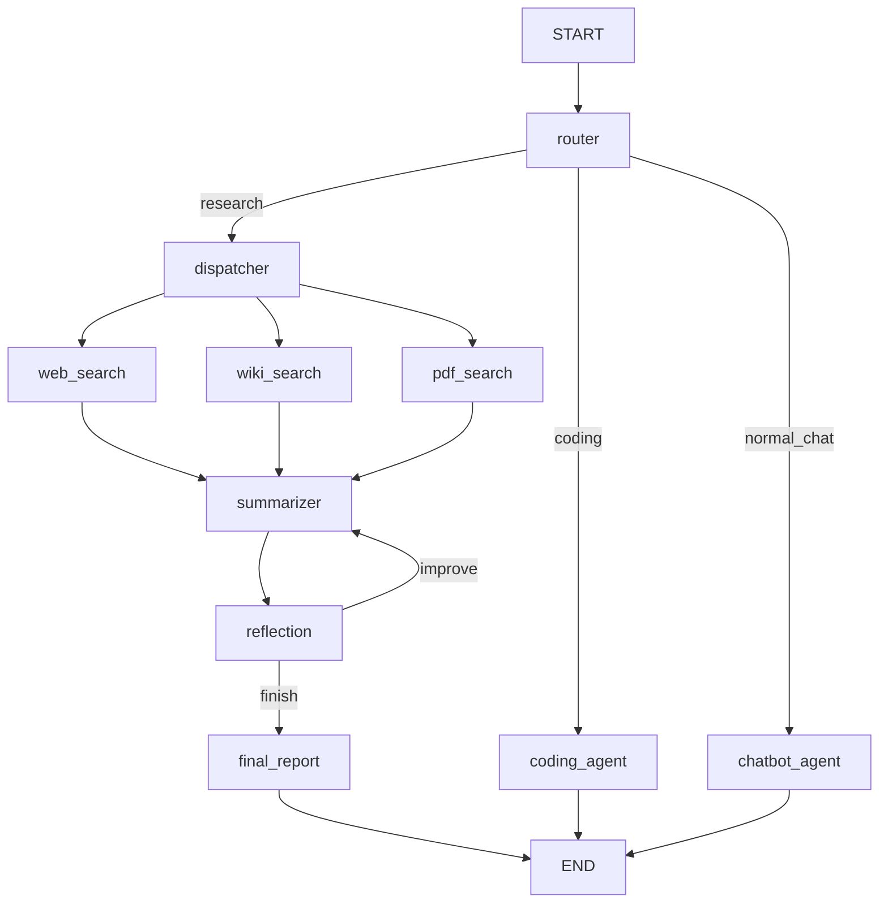

# 🧠 AI Research & Evaluation Assistant

> **B.Tech Final Year Project | AI Engineer Portfolio**  
> Full-stack multi-agent AI system using LangGraph, LangChain, Groq, FastAPI & Streamlit

---

## 📐 Architecture



## 🗂️ Project Structure

```
ai-research-assistant/
├── backend/
│   ├── __init__.py
│   ├── main.py              # FastAPI app
│   ├── graph.py             # LangGraph workflow
│   ├── state.py             # TypedDict shared state
│   ├── nodes/
│   │   ├── router_node.py
│   │   ├── research_dispatcher.py
│   │   ├── web_search_agent.py
│   │   ├── wiki_search_agent.py
│   │   ├── pdf_search_agent.py
│   │   ├── coding_agent.py
│   │   ├── chatbot_agent.py
│   │   ├── summarizer_node.py
│   │   ├── reflection_node.py
│   │   └── final_report_node.py
│   ├── schemas/
│   │   ├── route_schema.py
│   │   ├── reflection_schema.py
│   │   └── report_schema.py
│   └── utils/
│       ├── llm_client.py
│       └── logger.py
├── frontend/
│   └── streamlit_app.py
├── requirements.txt
├── .env.example
└── README.md
```

---

## ⚡ Quick Start

### 1. Clone & Setup
```bash
cd "ai assisant"
python -m venv venv
venv\Scripts\activate          # Windows
pip install -r requirements.txt
```

### 2. Configure API Keys
```bash
copy .env.example .env
# Edit .env and add your keys:
# GROQ_API_KEY=gsk_...
# TAVILY_API_KEY=tvly_...  (optional)
```

### 3. Start the Backend
```bash
uvicorn backend.main:app --reload --port 8000
```

### 4. Start the Frontend (new terminal)
```bash
streamlit run frontend/streamlit_app.py
```

Open **http://localhost:8501** in your browser 🎉

---

## 🔬 LangGraph Concepts Demonstrated

| Concept | Where Used |
|---|---|
| `StateGraph` | `graph.py` — graph container |
| `TypedDict` | `state.py` — state schema |
| `Annotated[list, add]` | `state.py` — parallel merge reducer |
| `add_node()` | `graph.py` — register nodes |
| `add_edge()` | `graph.py` — hardwired transitions |
| `add_conditional_edges()` | `graph.py` — router + reflection branching |
| Parallel fan-out | `graph.py` — dispatcher → 3 agents |
| Parallel fan-in | `graph.py` — 3 agents → summarizer |
| Iterative loop | reflection → summarizer (max 3 iterations) |
| Structured Output | router + reflection Pydantic schemas |
| Partial state updates | every node returns only changed keys |

---

## 🌐 API Endpoints

| Method | Endpoint | Description |
|---|---|---|
| GET | `/health` | Health check |
| POST | `/workflow` | Auto-routed query (recommended) |
| POST | `/research` | Force research pipeline |
| POST | `/chat` | Force chat response |

**Example:**
```bash
curl -X POST http://localhost:8000/workflow \
  -H "Content-Type: application/json" \
  -d '{"query": "Explain AI in healthcare"}'
```

---

## 🧩 Workflow Types

1. **Sequential** — Router → Summarizer → Reflection → Final Report  
2. **Parallel** — Web Search + Wikipedia + PDF simultaneously  
3. **Conditional** — Router branches: research / coding / chat  
4. **Iterative** — Reflection loops until quality score ≥ 7/10 (max 3 iterations)

---

## 📦 Tech Stack

- **LangGraph** `>=0.2.14` — Multi-agent graph orchestration  
- **LangChain** `>=0.2.16` — LLM abstractions & prompts  
- **Groq API** — Ultra-fast inference (`llama-3.1-8b-instant`)  
- **FastAPI** — Production REST API  
- **Streamlit** — Interactive web UI  
- **Tavily** — Real-time web search  
- **Wikipedia API** — Free encyclopedia search  
- **Pydantic v2** — Structured output validation  
